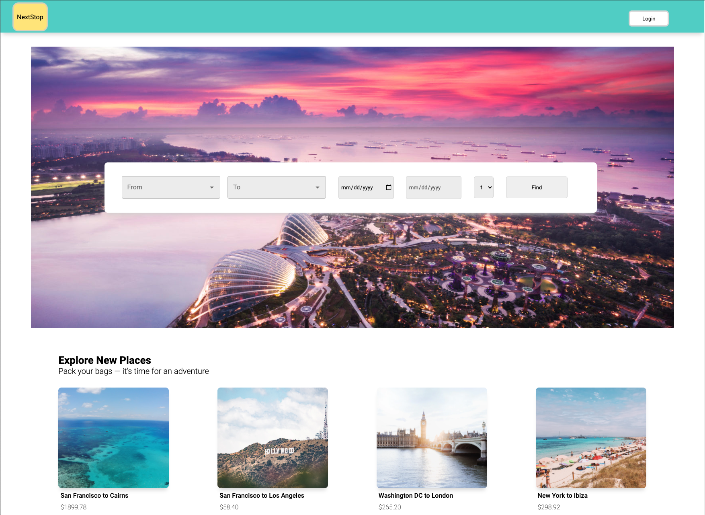

# NextStop

### About
*NextStop* is a one-stop travel web application that allows users to book a round-trip flight, hotel accommodation, and local experiences based on the selected destination and date. The UI of the application is modern minimalist to fit the aesthetic of affluent travelers who are looking for a seamless booking experience.

### Contributors
[Carman Leung](https://github.com/cleung0112)

[Dana Walsh](https://github.com/danaewalsh)

[Kanchan Chauhan](https://github.com/kc127)

[Liem Nguyen](https://github.com/lnguy089)

[Michael Moriarty](https://github.com/MichaelRMoriarty)

[Nils Patel](https://github.com/nilaip96)

[Shay Rosner](https://github.com/Smrosner)

### Tech Stack
*NextStop* was built primarily with ReactJS on the front end and Node/Express on the backend. Other key technologies used are listed below:

# Client Deliverables
Our team strived to meet the expectations of our primary user by organizing deliverables into user stories listed below:

#### User Stories
* As a user, I should be able to sign up for an account

* As a user, I should be able to sign in to my account

* As a user, I should see a list of suggested destinations/experiences on the home page

* As a user, I should be able to select dates and a destination for my trip

* As a user, I should see a list of destination suggestions on the home page

* As a user, I should see a list of flights that work with my inputted dates and destination

* As a user, I should be able to choose the flights that work best for me and add them to my trip

* As a user, I should see a list of hotels that work with my inputted dates and destination

* As a user, I should be able to choose the hotel that works best for me and add it to my trip

* As a user, I should see a list of experiences that work with my inputted dates and destination

* As a user, I should be able to choose the experiences that work best for me and add them to my trip

* As a user, I should be able to review my trip details and remove any details that no longer work for me

* As a user, I should be able to input my personal info purchase my travel package

* As a user, I should be able to access and utilize NextStop from my phone

## Minimum Viable Product (MVP)
The MVP of the app has an interactive search that allows the display of lost or found dogs from other sources and then find a list of lost/found dogs based on location. The user can also share a specific posting on Facebook.

## Wireframe

### How the App Works:

#### Home Page

#### Flights

#### Hotels

#### Experiences

#### Trip Review

#### Purchase Page

#### Confirmation

